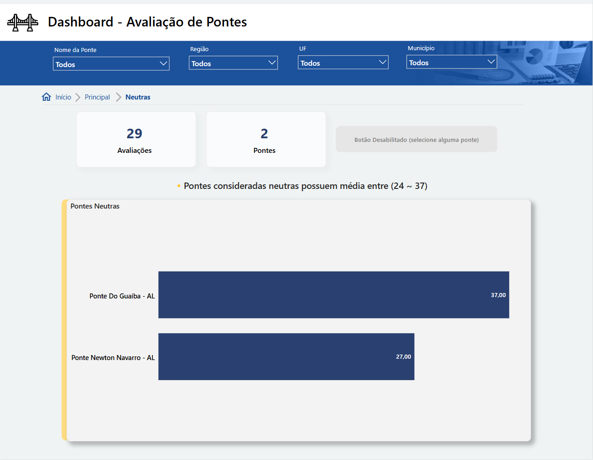
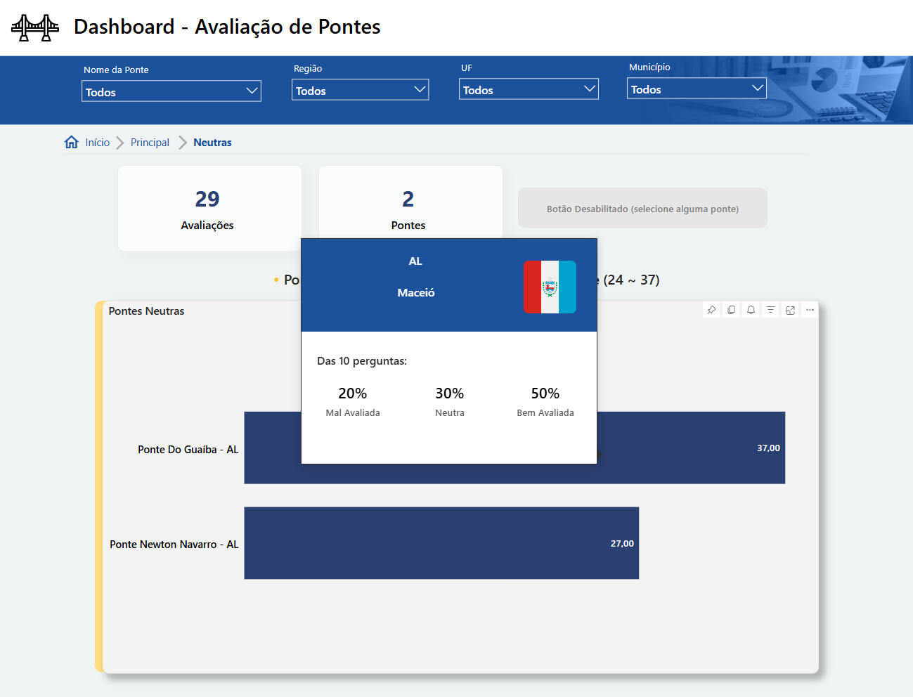
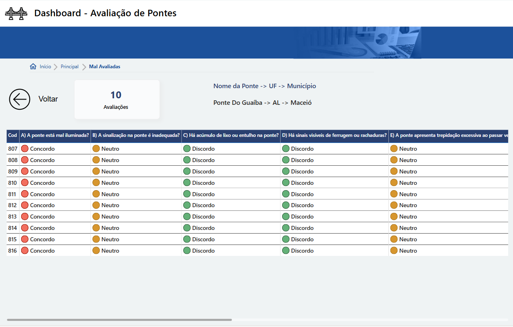

# Painel de Avaliação de Pontes do Brasil

Este painel em Power BI tem como objetivo fornecer uma visualização clara e interativa sobre as condições estruturais e a percepção de segurança das pontes em todo o Brasil, com base em avaliações feitas por meio de um questionário.

## 🌉 Propósito do Projeto

O projeto foi inspirado em um cenário real de monitoramento de infraestrutura, mas utiliza **dados simulados e gerados artificialmente**. A ideia central é entender a percepção pública sobre a segurança e conservação das pontes brasileiras, permitindo que gestores e analistas identifiquem padrões e pontos críticos que demandam atenção.

## Como foi feita a avaliação das pontes?

Cada ponte foi avaliada com base em **10 perguntas**. A cada resposta foi atribuída uma pontuação:

- Concordo Totalmente → **1 ponto**
- Concordo → **2 pontos**
- Neutro → **3 pontos**
- Discordo → **4 pontos**
- Discordo Totalmente → **5 pontos**

Com isso:

- **Pontuação mínima possível por avaliação:** 10 (10×1)
- **Pontuação máxima possível por avaliação:** 50 (10×5)

## Como categorizamos as pontes?

Para classificar as pontes em três categorias (Mal Avaliada, Neutra, Bem Avaliada), dividimos o intervalo entre 10 e 50 em três partes:

- Intervalo total: 50 - 10 = 40
- Tamanho de cada faixa: 40 ÷ 3 ≈ 13,33

**Classificação final:**

- **Mal Avaliada:** média entre **10 e 23**
- **Neutra:** média entre **24 e 37**
- **Bem Avaliada:** média entre **38 e 50**

## 📌 Exemplo

Se uma ponte teve média de pontuação igual a **35**, ela será classificada como **Neutra**.  
Se teve **38.6**, será **Bem Avaliada**.

## 📝 Perguntas do Questionário

As perguntas foram formuladas com **caráter negativo**, ou seja, quanto mais as pessoas discordam, melhor é a percepção da ponte:

1. A) A ponte está mal iluminada?
2. B) A sinalização na ponte é inadequada?
3. C) Há acúmulo de lixo ou entulho na ponte?
4. D) Há sinais visíveis de ferrugem ou rachaduras?
5. E) A ponte apresenta trepidação excessiva ao passar veículos?
6. F) A estrutura da ponte aparenta má conservação?
7. G) Há dificuldades de acesso para pedestres ou ciclistas?
8. H) Há buracos ou desníveis na ponte?
9. I) A ponte apresenta tráfego frequentemente congestionado?
10. J) Você se sente desconfortável/inseguro ao passar na ponte?

## Sobre os Dados

Os dados utilizados no painel foram **gerados artificialmente** por meio de um script Python, com o auxílio de uma IA. O CSV final contém:

- Nome da ponte
- Estado (UF) e município
- Respostas individuais para cada pergunta
- Pontuação da avaliação
- Código identificador da manifestação (`cod_manifestacao`)

O dataset conta com **1.500 avaliações** distribuídas por diversas pontes em todos os estados brasileiros, permitindo análises regionais e comparativas.

## 📊 Navegação no Power BI

### 🔹 Aba Principal

- Distribuição de pontes por UF e região
- Visão geral da classificação das pontes (bem avaliadas, neutras, mal avaliadas)
- Filtros por estado, município, região, classificação da ponte e nome da ponte
- Gráfico alternável: quantidade de avaliações por estado e município

- Uso de *Drill Through*: clique com o botão direito em uma barra da classificação desejada e selecione "Drill through"

### 🔸 Página de Classificação (Mal Avaliadas, Neutras ou Bem Avaliadas)

- Após aplicar o *Drill through*, você será redirecionado para uma página com os filtros aplicados anteriormente.
- Exemplo: aba "Neutras" com filtro do estado de Alagoas.

- Uso de *hover* nos gráficos para exibir:
  - UF e município
  - Percentual de respostas para cada tipo (bem avaliadas, neutras e mal avaliadas)

- Possibilidade de um segundo *drill through* a partir do gráfico

- OBS: Essas funções também serve para as outras abas (Bem avaliadas e Mal avaliadas)

### 🔻 Detalhamento

- A aba de detalhamento apresenta em formato de tabela todas as respostas individuais para as 10 perguntas da ponte selecionada.

## Link do Power Bi

https://app.powerbi.com/view?r=eyJrIjoiMWQ2NmM4MmUtYzA3NS00NjMxLWE3N2ItNzcyMmJmZTJjZGE0IiwidCI6ImQ5NzZkNWZjLTk2NWItNDkyZi1hOTkxLWIwZGRkOTQ5ZmI2YyJ9

